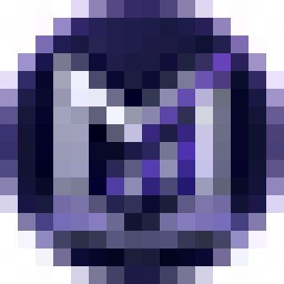
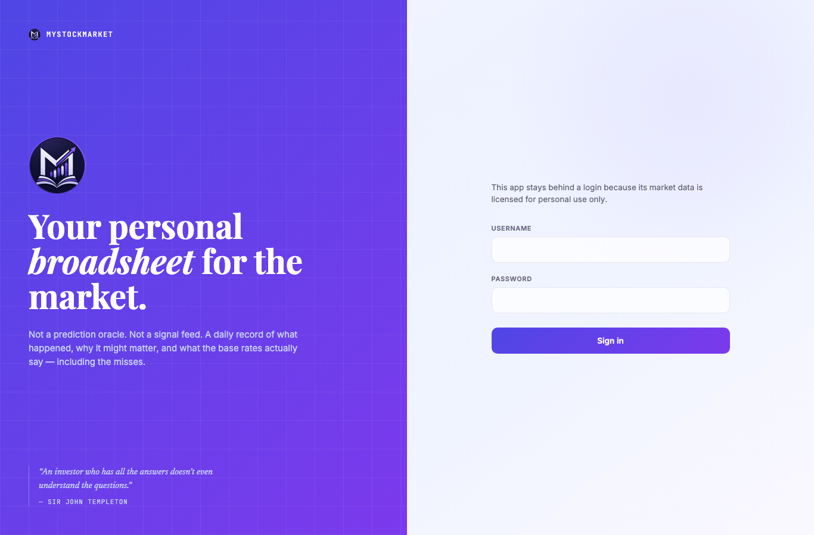
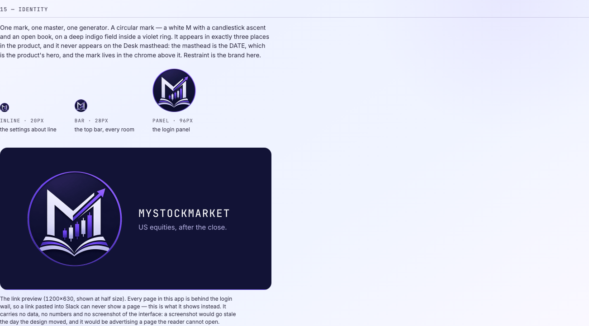

# PD2 — Brand: the identity kit

**Tag:** `pd-2` @ `5e6dc77` · **tag run:** [29310780130](https://github.com/bishantt/myStockMarket/actions/runs/29310780130) — **green, first try** (eight tags, eight first-try greens)
**Rehearsal:** [29309905263](https://github.com/bishantt/myStockMarket/actions/runs/29309905263) — the same job, on the same SHA, before the tag existed
**Date:** 2026-07-14 · **Plan:** POLISH-AND-DEPTH-PLAN.md Part 5

---

## What this phase did, in one paragraph

The app had good plumbing and no face. It shipped with a placeholder in the top bar — a gradient
tile with a mono letter "M" set inside it — and, it turns out, with **no browser tab icon at all**.
PD2 replaced the placeholder with the real logo and built the machinery around it: **one master file
goes in, ten artifacts come out**, every one of them with a named size, geometry, budget and
consumer. There is now one generator (`npm run brand`), one door in the app that may render the mark
(`components/BrandMark.tsx`), and one place a brand colour may be stated outside the token sheet —
policed by a new anti-drift rule. The link preview, which is the only public face a login-walled
product has, is generated from the same master and is now photographed by the pixel oracle.

---

## 5.2 — the artifact table, with the bytes it actually shipped

Every row is generated by `app/scripts/brand-assets.mjs` from `assets/brand/logo-source.png`.
Printed by the generator itself; the budgets are asserted, and the script exits non-zero on a miss.

| # | File (under `app/public/`) | Bytes | Budget | Consumer |
|---|---|---:|---:|---|
| 1 | `favicon.ico` (16+32+48) | 14.7 KB | 19.5 KB | the browser tab |
| 2 | `icons/icon-192.png` | 6.1 KB | 19.5 KB | manifest — `any` |
| 3 | `icons/icon-512.png` | 30.7 KB | 58.6 KB | manifest — `any` / splash |
| 4 | `icons/icon-maskable-512.png` | 22.2 KB | 39.1 KB | manifest — `maskable` |
| 5 | `icons/icon-maskable-192.png` | 4.6 KB | 11.7 KB | manifest — `maskable` (new) |
| 6 | `icons/icon-monochrome-96.png` | 0.5 KB | 3.9 KB | manifest — `monochrome` |
| 7 | `apple-touch-icon.png` | 5.0 KB | 19.5 KB | iOS home screen |
| 8 | `icons/brandmark-64.webp` | 2.8 KB | 3.9 KB | `BrandMark` — top bar (28px) |
| 9 | `icons/brandmark-192.webp` | 10.8 KB | 11.7 KB | `BrandMark` — login (96px) |
| 10 | `icons/og-card.png` | 58.2 KB | 293.0 KB | `openGraph` + `twitter` |

**Icon set (rows 1–9): 97.3 KB of the 120 KB budget. OG card: 58.2 KB of 300 KB.**
**Bundles did not move** — worst case `/news` at 196.3 KB, exactly as before. Images are not code,
and `check:bundles` proves it by not moving. `png-to-ico` and `opentype.js` are devDependencies.

Verified live, unauthenticated, against production after deploy — all ten paths **200**:

```
/favicon.ico                  200  image/vnd.microsoft.icon   15086 B
/apple-touch-icon.png         200  image/png                   5121 B
/icons/icon-192.png           200  image/png                   6196 B
/icons/icon-512.png           200  image/png                  31961 B
/icons/icon-maskable-192.png  200  image/png                   4798 B
/icons/icon-maskable-512.png  200  image/png                  24431 B
/icons/icon-monochrome-96.png 200  image/png                    489 B
/icons/brandmark-64.webp      200  image/webp                  2844 B
/icons/brandmark-192.webp     200  image/webp                 10830 B
/icons/og-card.png            200  image/png                  59967 B
```

---

## The three things the plan did not know

### 1. The master's transparency is painted on

Plan PP-1 describes "the circular mark on transparency". **The file has no alpha channel at all.**
The tool that produced it rendered the transparency *checkerboard* into the pixels — the top colours
in the image are `#fefefe` and `#f5f5f5`, which are the checker squares themselves. Dropped in as
delivered, every icon in this app would have shipped with a grey-and-white chequered box around the
mark.

`scripts/brand-geometry.mjs` keys it out, and the method is chosen to be safe rather than clever:

1. A pixel is a checker candidate if it is **light AND grey**. Both halves matter — the mark's own
   whites (the M, the book) are light too, but they are faintly blue (`#ecedfd`), while the checker
   is pure grey.
2. The candidates are then **flood-filled from the image border**. This is the safety net: even if a
   pixel of the white M were grey enough to fool the colour test, the M is in the middle of the mark
   and a fill starting at the edge can never reach it. Measured on the real master: **zero** pixels
   of the M's stroke were keyed out.

The mark's true circle is then fitted and a real alpha cut from it. `myLogo.png` and `myLogo1.png`
were both checked; `myLogo.png` **does** carry real alpha but is the navy/**gold**/green version — the
wrong palette entirely, and green candles collide with this app's reserved colour semantics.
`myLogo11.png` is the right artwork.

### 2. sharp cannot use our fonts, and it fails silently

The OG card needs type. sharp accepts a `fontfile`, so the obvious move is to hand it ours. Measured:

| what was rendered | result |
|---|---|
| "myStockMarket", 40px, **no font named** | 1135 × 159 |
| "myStockMarket", 40px, **JetBrains Mono Medium** (monospace) | 1135 × 159 |
| "myStockMarket", 40px, **Inter Regular** (proportional) | 1135 × 159 |

Three different fonts cannot set one string to one width. **Pango was ignoring the file** and
substituting whatever this Mac happened to have installed (it has *"JetBrainsMono Nerd Font"* and no
Inter at all). The card would have shipped in a system font — and in a *different* system font on the
next machine — and nothing anywhere would have said so.

So no font is resolved at all. `scripts/brand-type.mjs` converts the two strings to **vector
outlines** straight from the two TTFs vendored in `assets/brand/fonts/` (both SIL Open Font License;
the licences are committed beside them). By the time anything is rasterised there is no text left,
only shapes — it renders identically on this Mac, on a CI runner, and on a machine with no fonts.

### 3. The icon budget was written for vector art

The mark this replaced was a flat SVG tile: the old 512px icon was **19 KB**. The new one is a
rendered illustration with gradients and a soft shadow, and encoded straight it is **300 KB** — one
icon, two and a half times the whole icon set's 120 KB budget.

**The budget check caught it on the first run, which is the entire reason it exists.** Palette
quantisation closes the gap, because the artwork has a small true palette (navy field, violet ring,
near-white glyphs):

| 512px icon, encoder | bytes |
|---|---:|
| straight, compressionLevel 9 | 299.7 KB |
| palette, quality 90 (256 colours) | 86.1 KB |
| **palette, 128 colours** ← shipped | **30.7 KB** |

At 128 colours the only difference a person can find is a faint dither in the field, at a size nobody
inspects. The OG card keeps the full 256, because it carries **type**, and quantising letterforms is
where banding actually becomes visible.

---

## The blank tab — repaired in passing

`proxy.ts` has allowlisted `/favicon.ico` since P0. **No such file has ever existed.** The old
generator wrote `favicon.png`, nothing linked it, and this app has been shipping with a blank browser
tab for its entire life. The first production poll after deploy caught it mid-repair:

```
attempt 1: /favicon.ico -> 404   content-type: text/html   <- the old world
attempt 2: /favicon.ico -> 200   content-type: image/vnd.microsoft.icon
```

`e2e/brand.spec.ts` now fetches **every** brand path unauthenticated and asserts 200 + content-type.
It would have said so on day one.

---

## The 16px legibility gate (plan 5.3 — eyeball, honest)

The favicon's 16px member, at actual size, and blown up ten times with no smoothing:

| actual size | 10×, nearest-neighbour |
|---|---|
|  |  |

**PASS.** The plan set the bar honestly: *"at 16px the candlesticks and book will read as texture —
that is acceptable; what must survive is the identity silhouette: violet ring + white M."* Both
survive. The M is recognisably an M. **The sanctioned fallback (re-rendering the 16px member at 115%)
was not needed and was not used.**

The mark at every size it is actually seen, on both papers:


---

## The lockups

**Top bar (28px)** — the placeholder tile is gone; the wordmark text is untouched.


**Login (96px)** — the first thing anyone ever sees. The OG card echoes this composition on purpose.



**The link preview (1200×630)** — the only public face a login-walled product has. No data, no
numbers, no screenshot of the UI: a screenshot goes stale the day the interface moves, and it would
be advertising a page the reader cannot open.


Verified as an unfurler sees it (no cookie), against production:

```
og:image        https://mystockmarket-eight.vercel.app/icons/og-card.png   <- ABSOLUTE
og:image:width  1200      og:image:height 630
twitter:card    summary_large_image
```

**The styleguide's new Identity section** is the permanent visual spec — and it is what puts the OG
card in front of the pixel oracle. No product page renders that card, so without this section nothing
in the gate would ever notice the generator starting to draw a different one.



**The Desk masthead did NOT gain the logo.** The masthead is the DATE, which is the product's hero;
the mark lives in the chrome above it. Restraint is the brand here.

---

## THE FIND: the Desk's pixel baseline was asserting which tests ran first

This is the part of PD2 that was not about brand at all, and it is the most valuable thing the phase
produced.

Reading the expected VRT reds, the Desk's diff was **1,291 px** while every other room's was exactly
**746 px**. 746 is the 28px mark, in the identical place, in every room. The Desk had ~545 px more,
and they were at the *bottom* of the page. Blown up, the two pictures said:

```
old baseline:  none saved tonight
new actual:    + 1 more · 1 saved tonight
```

**`e2e/briefing.spec.ts` writes a journal entry, it runs before `e2e/vrt.spec.ts` (workers: 1,
alphabetical), and it never cleans up.** So the Desk the *full oracle* photographs says "1 saved
tonight", while the baseline minted by the standalone `vrt-baselines` job — which runs `vrt.spec`
alone against a fresh database — says "none saved tonight".

**Those two pictures have disagreed by 387 pixels for as long as the baseline has existed.** Nobody
knew, because `maxDiffPixels: 600` was quietly absorbing it. PD2's mark added 746 more pixels to the
same shots; 387 + 746 cleared the tolerance, the Desk went red, and the old disagreement fell out of
the failure.

`e2e/desk.spec.ts` already refused to assert that number, in those words — *"asserting 'none saved
tonight' would be asserting the test ORDER, not the product."* **The oracle now refuses too:**
`Disclosure` takes an opt-in `maskCount`, and the journal is its only consumer. The reader still sees
the count; the camera does not. Its typography stays pixel-locked through the watchlist's disclosure,
which counts something that does not move.

### The second half of the same find: 45 shots that changed and did not fail

Only **14** baselines went red. **59 actually changed.** The other 45 moved by 746 px — under the
tolerance — and would have gone on passing while showing a top bar this app no longer has.

All 59 were re-baselined. **A baseline that is tolerated is still a baseline that is wrong**, and the
next real change to that top bar would have been measured against a picture of the old one.

| group | shots | what moved |
|---|---:|---|
| room shots | 44 | exactly 746 px at x35–62 y20–47 — the 28px mark, nothing else |
| desk | 5 | the mark + the masked journal count |
| login | 2 | the 96px panel lockup and the headline it pushes down |
| settings | 5 | +60 px tall — the about line |
| styleguide | 4 | +769 px (desktop) / +858 px (phone) — the Identity section |

(`track-record-dark-desktop` is 748: the mark, plus two pixels of anti-aliasing noise.)

---

## The post-deploy gate

| check | result |
|---|---|
| `check:live` | **all 6 green** (1 PENDING — news bylines, owed to PD8) |
| `check:migrations` | clean — the live database runs this repo's schema |
| `check:nav` | every cached room 42–94 ms · `/settings` 385 ms (the one writer room, `force-dynamic`, argued) |
| `check:lighthouse` | **CLS 0.000** ✓ · **first-load JS 177 KB** ≤ 200 KB ✓ · perf 86 (was 87) · LCP 3.83 s (was 3.86 s) |
| `check:bundles` | **unmoved** — worst `/news` 196.3 KB |
| `check:fonts` | 243 KB of 560 KB |

**LCP did not move** (3.83 s vs 3.86 s at PD1). Plan 5.7 required LCP unchanged ±10% — *"if LCP moves
more, the image joined the critical path wrongly; fix, don't accept."* It did not.

## One flake, read before it was believed

The rehearsal's phone leg failed `nav-timing — Desk → Scans`: median 451 ms against a 400 ms ceiling.
It was **not** re-pointed and it was not assumed. The application code between the passing run
(`eafa62a`, median 243 ms) and the failing one (`5e6dc77`) is **identical** — the only difference is 59
PNG baseline files, which cannot slow a client-side navigation. And the samples were bimodal:

```
[451, 178, 904, 877, 164, 178, 482]
```

Half of them are *faster* than the passing runs (164–178 ms); a few spiked to 900 ms. A real slowdown
moves every sample. `gh run rerun --failed` → green. Runner contention.

---

## Gate size at `pd-2`

**23 drift rules · 76 VRT baselines · 23 e2e specs · 638 unit tests · 16 bundle baselines · 14
manifest rooms · tag run 8 m 17 s.**

Growth, and the reason for each:

- **+1 drift rule (23)** — *the brand's hexes have one door outside the token sheet.* Rule 1 never
  looked at `scripts/` or `public/*.svg`, so a hex in either was unpoliced — and a generator that
  stamps a colour into ten binary files nobody can grep is exactly where that matters. The generator
  is the sanctioned door because it does not merely *state* the field colour: it re-samples the
  master and refuses to run if the pixels disagree. Proven to bite (a smuggled `#4f46e5` in
  `check-routes.mjs` reds the run).
- **+1 e2e spec (23)** — `brand.spec.ts`: every brand path fetched unauthenticated, 200 +
  content-type, plus the login mark and the OG card's absolute URL.
- **+13 unit tests (638)** — the generator's geometry, against **synthetic** fixtures only. A test
  that asserted today's logo is today's logo would pass forever and prove nothing, and would go red
  the day the mark is redrawn — which is precisely the day it should stay green. One of them earned
  its keep immediately: a fatter synthetic shadow walked straight through the first disc fit, so the
  fit was rewritten to take a **median over angular sectors**, which no smear on one side can drag
  outward.
- **+1 amendment to drift rule 20** — `BrandMark.tsx` is the argued second door for imagery. None of
  the three risks rule 20 exists to prevent (hotlinking, missing dimensions, undesigned empty states)
  applies to a file we generate ourselves at a fixed size.
- **VRT baseline count unchanged at 76; 59 of them re-photographed** (see above).
- **Bundle baselines unchanged at 16, and unmoved.**
