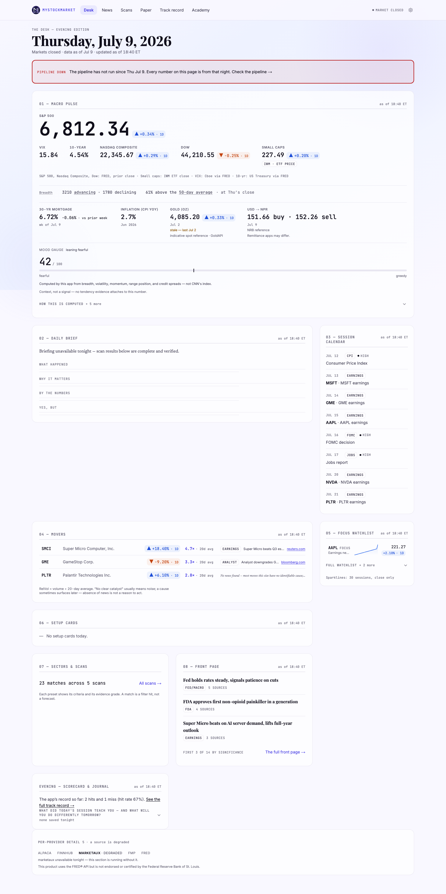
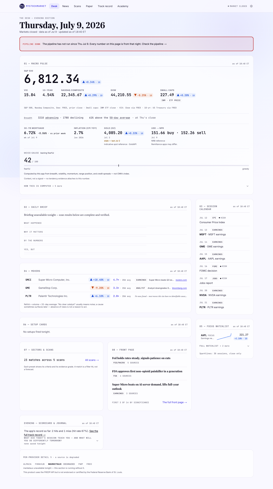

# PD3 — the desktop grid contract v2

**Tag:** `pd-3` · **Plan:** POLISH-AND-DEPTH-PLAN.md Part 6 · **Executed:** 2026-07-14

The Desk had a hole in it. On a thin night — the briefing held, no setup cards — a short module dug a
dead acre of nothing into the middle of the app's main room, and the user found it by looking at his
own screen. This phase closes it, proves it closed, and pins the night it happens on so that no human
ever has to find it again.

Two other defects fell out of the guards along the way. Neither was PD3's to cause; both had been
green for months.

---

## 1. The defect, reproduced and measured

Not described — **reproduced.** The `pd-2` build was checked out into a worktree, built, and pointed at
the same database, thinned to the same night. The screenshots below are the same edition, the same
viewport (1512×982, the 16" MacBook the user reads on), fifteen minutes apart.

| | before (`pd-2`) | after (`pd-3`) |
|---|---|---|
| Gap 02 → 04 (Brief → Movers) | **334 px** | **24 px** |
| Gap 04 → 06 (Movers → Setups) | 24 px | 24 px |
| Gap 06 → 07 (Setups → closing) | 24 px | 24 px |
| Full page height | 3028 px | **2706 px** |

The page is **322px shorter**, and that number is the hole.

**The mechanism, exactly.** The spread was ONE grid: every module a direct child, pinned to a column
with `lg:col-start-*`, auto-placed into shared implicit rows. A grid row is as tall as its tallest
cell. The held Brief (~200px) shared a row track with the Session Calendar (~600px, and open by
default on desktop by APP-FEEL's own rule). `items-start` pinned the short Brief to the top of that
shared track, and 04 Movers — pinned to column 1 of the NEXT row — could not begin until the
Calendar's track ended. `grid-flow-row-dense` cannot help: it backfills empty CELLS, not slack inside
a track.

---

## 2. Law 1 — the two columns flow independently

The main column and the rail are two flex stacks side by side in a two-cell grid. **They share no row
tracks at all**, so there is no track left for a short module to leave slack in.

### The price, stated rather than discovered

CSS can only group children that are **adjacent in the DOM**. The ritual interleaves the two columns
(brief, calendar, movers, watchlist…). So a DOM in ritual order and a DOM grouped into columns are
**mutually exclusive** — there is no CSS that gives you both. Something had to give, and what gives is
the DOM:

- **The DOM is now main-then-rail at every width:** 01, then 02 / 04 / 06 / 07+08+scorecard, then 03
  and 05. That is the reading order amendment **0.2.2** already chose on the merits (a broadsheet is
  read column-first; the rail is reference matter by the app's own definition), and it is now what a
  screen reader hears at *every* width — one consistent story rather than two.
- **Below `lg` the ritual is restored visually** with `display: contents` on the wrappers plus `order`
  utilities. The order numbers *are* the ritual indices.
- **The cost:** below `lg`, a sighted keyboard user tabs main-then-rail while seeing the ritual. That
  is a WCAG 2.4.3 divergence, **axe cannot see it** (no tool can — it is a comparison between two
  orders, not a property of one), and it is booked in DECISIONS.md rather than left to be discovered.

**The alternative was tried on paper and is strictly worse.** A rail that row-SPANS the main column
keeps the ritual DOM — but when the rail is taller than the main column, the grid grows the spanned
rows to fit it, and the dead gap comes straight back, merely *distributed* between the main modules
instead of pooled under the Brief. That is the thin-night case, which is the case the law exists for.

### What holds it

`e2e/grid.spec.ts` measures **bounding boxes**, not the DOM — because a DOM assertion would have passed
happily through this entire rewrite while the screen showed something else. The old ritual test did
exactly that, and it is now the *reading-order* assertion in `desk.spec.ts`. The two are halves of one
contract; neither is sufficient alone.

| assertion | where | verdict |
|---|---|---|
| below lg, the reader SEES 01 → 08 down one column | phone | ✅ |
| at ≥lg, main = [02, 04, 06, 07] top-to-bottom | desktop · mbp16 | ✅ |
| at ≥lg, rail = [03, 05], and sits to the RIGHT of main | desktop · mbp16 | ✅ |
| on a THIN night, no gap > 48px between main modules | desktop · mbp16 | ✅ (24/24/24) |
| DOM reading order = [1,2,4,6,7,8,3,5] | desktop · phone | ✅ |

---

## 3. Law 2 — a module takes only the height it earns

`Placeholder` graduated from a page-local helper to **`components/EmptyModule.tsx`**, and **drift rule
24** greps `min-h-` across every surface in the app. Three argued exemptions, none of them a loophole:
`min-h-11` (the 44px touch floor — the opposite rule, and a requirement), `min-h-0` (a *reset*, which
reserves nothing), and `min-h-dvh`/`min-h-screen` (the page shell). The rule found `min-h-0` on its
first run and was right to look and wrong to fail; that is how it learned the difference between
reserving height and refusing to.

**The shimmer is gone, and that is the point.** A shimmer means *content is on its way*. That is true
on an empty database — and **false on a thin night**, where the run happened and the setup cards simply
did not fire. Nothing is coming. The shimmer told the reader to wait for something that does not exist,
and "the run found nothing" is the common case while "the database is empty" happens once.

| | before | after |
|---|---|---|
| empty setup-cards module (1512) | 124 px | **104 px** |
| the plan's band budget | ~112 px | ✅ |

And the copy now distinguishes two different facts that had been reading the same:

- `morning.setupCards === null` — nothing has ever run → *"Setup cards arrive with the nightly base
  rates."* (a schedule; **no timestamp**, because none exists and a fabricated one is worse than none)
- `morning.setupCards === []` — the run happened and nothing fired → *"No setups fired tonight."*
  (a **finding**, as of a moment, so it takes the run's stamp)

An empty array is truthy, so the old code handed `[]` straight to `SetupCards`, which rendered its own
bespoke 124px empty state carrying no timestamp at all. `SetupCards` no longer has an empty branch:
there is **one** empty state in this app, and the caller decides when to show it. Six modules each
inventing their own is six heights nobody can hold to a budget, which is the disease Law 2 cures.

---

## 4. The three defects the guards found

**All three were green before this phase. None of them was caused by it.** This is the part of PD3
that matters most, and it was not in the plan.

### 4.0 THE BIG ONE — `/ticker` on a phone has been broken in production, and the baseline was a photograph of it

The Range Ladder — the app's central **probability visual**, the thing that says what a range actually
*means* — has been rendering its sentences **one word per line** on phones:

> In / the / past, / 8 / in / 10 / 5- / day / paths / from / here / stayed / inside / this / range.

`ticker-light-phone-linux.png` and `ticker-dark-phone-linux.png` — the **committed** baselines, green
run after run for months — **are pictures of that.** The oracle photographed the bug, filed it as the
baseline, and defended it on every run.

**The mechanism.** `RowText` is a `flex-wrap` row of four things. The sentence span was `min-w-0
flex-1` — which is `flex: 1 1 0%`, a **flex-basis of zero**. A flex item whose hypothetical main size
is zero **can never cause its line to wrap; it can only be crushed.** So the row balanced on a knife
edge: narrow enough and the `shrink-0` sample-size caption wrapped to its own line, leaving the
sentence full width (three tidy lines); **eight pixels wider** and the row decided all four items
"fitted" — because the sentence could shrink to nothing to make room — so the caption stayed put and
the sentence became a vertical column of words.

**The fix:** `min-w-[18ch]`. A flex item's `min-width` **does** participate in line breaking (the
hypothetical main size is the flex base size *clamped by min/max*), so when eighteen characters no
longer fit, the line **wraps** — which is what it always meant to do. Swept **14 widths from 320 to
1536** on both surfaces that render the ladder: 1–3 lines at every one, no band left that crushes it.

**How it surfaced, which is the lesson.** Not from a test. PD3 moved the styleguide's gutter by four
pixels, which made the styleguide's copy of the same component fall into a *different* wrong state,
which changed its **height** — the candidate came back **272px taller**. And **a page that gets wider
is not supposed to get taller.** I only had that number because PD2's law says to diff *every*
candidate rather than read the failure list. I pulled the thread because the arithmetic was absurd,
not because anything was red.

> **A VRT baseline proves a page has not CHANGED. It does not prove the page was ever RIGHT.** If the
> first baseline is already wrong, the oracle locks the bug in and defends it forever, and nothing ever
> fails. PD2's law was "a baseline that is TOLERATED is still WRONG". This is the harder version: **a
> baseline that is EXACT can still be wrong.** The tolerance was innocent here. The picture was the lie.

The `-332px` on both ticker phone baselines in §9 is that bug being removed.

### 4.1 The Desk's front-page headlines were a 23px tap target on a phone

`FrontPagePreview`'s headline links measured **338×23** on a phone — and the 44px sweep had been
**passing**. The sweep runs on **Linux**, where Playfair Display sets wider: the headline wraps to two
lines, and two lines of 23px clear 44px *by accident*. On macOS and iOS metrics the same headline fits
on **one** line, and the tap target is 23px.

**So on the reader's actual iPhone this was under the floor the whole time, and the guard was green.**

Verified against the `pd-2` tag rather than assumed — the identical failure reproduces there, byte for
byte. A rule that holds only because a font happened to wrap is not a rule; it is a coincidence. Fixed
with `min-h-11 md:min-h-0`, the exact idiom the movers' source link already uses (44px for a thumb,
given straight back above the phone where there is no thumb).

### 4.2 `/academy/[slug]` had never been swept by anything (Q-G3-2 — CLOSED)

The lesson family was the one room in the manifest with an **empty `sweeps` list**. The Academy's frame
is swept at `/academy`, so a lesson *looked* covered, and its own controls had never been measured by
anything at all — the glossary popovers live there.

The sweep was added (a one-line manifest change) and **found a defect on its first run**: the
"← All lessons" back link was **17px** tall, while its identical twin one directory over on
`/academy/review` has carried a 44px box since the day it shipped. Nothing had ever failed, because
nothing had ever looked.

---

## 5. `PageContainer` — one door for the room measure (drift rule 25)

Every room sits in the same measured column: centred, capped at 1360px, 1500px in the `wide` band,
16px gutters stepping to 32px at `desk`. **One decision, written out by hand in five places** — both
layouts' `<main>`, both top bars, the styleguide. They agreed, which is not the same as being safe: the
next change to this column was a five-file sweep, and the file you forgot produces a room subtly
narrower than every other room, on one breakpoint, which nobody would ever catch by looking.

The styleguide was **already out of step** and nobody knew: it used a 20px phone gutter where every
real room uses 16px — a four-pixel disagreement between the specification and the thing it specifies.
It now sits in the same container as the rooms it documents.

---

## 6. The per-room verification pass

Every room, at every width, measured in a real browser. **39 room×width checks at the desktop widths,
13 more at 390. Zero problems.**

| room | 1366 | 1512 | 1536 | verdict |
|---|---|---|---|---|
| `/` (the Desk) | 1296px · ov 0 | 1296px · ov 0 | 1436px · ov 0 | clean · **1366 ≡ 1512** |
| `/news` | 1296 · 0 | 1296 · 0 | 1436 · 0 | clean · 1366 ≡ 1512 |
| `/news/[cluster]` | 1296 · 0 | 1296 · 0 | 1436 · 0 | clean · 1366 ≡ 1512 |
| `/scans` | 1296 · 0 | 1296 · 0 | 1436 · 0 | clean · 1366 ≡ 1512 |
| `/scans/[preset]` | 1296 · 0 | 1296 · 0 | 1436 · 0 | clean · 1366 ≡ 1512 |
| `/ticker/[symbol]` | 1296 · 0 | 1296 · 0 | 1436 · 0 | clean · 1366 ≡ 1512 |
| `/paper` | 1296 · 0 | 1296 · 0 | 1436 · 0 | clean · 1366 ≡ 1512 |
| `/track-record` | 1296 · 0 | 1296 · 0 | 1436 · 0 | clean · 1366 ≡ 1512 |
| `/settings` | 1296 · 0 | 1296 · 0 | 1436 · 0 | clean · 1366 ≡ 1512 |
| `/academy` | 1296 · 0 | 1296 · 0 | 1436 · 0 | clean · 1366 ≡ 1512 |
| `/academy/glossary` | 1296 · 0 | 1296 · 0 | 1436 · 0 | clean · 1366 ≡ 1512 |
| `/academy/review` | 1296 · 0 | 1296 · 0 | 1436 · 0 | clean · 1366 ≡ 1512 |
| `/academy/[slug]` | 1296 · 0 | 1296 · 0 | 1436 · 0 | clean · 1366 ≡ 1512 |

*(interior = the content box the room actually lays out in; `ov` = `scrollWidth − clientWidth`)*

**Horizontal scroll: zero at 390 / 1512 / 1536, every room.** (390: 358px interior, ov 0, all 13.)

### The finding that matters, and that a future session must not re-derive

**1366 and 1512 render an IDENTICAL 1296px interior.** 1512 sits *inside* the `desk:` band (1366–1535)
and the container caps at `max-w-[1360px]` — so a room whose composition is decided by the BREAKPOINT
is the same layout at both widths, with more margin around it. Only the `wide` band (≥1536) opens up,
to 1436px.

**So the `mbp16` project does not buy a new layout map, and it would be dishonest to imply it does.**
What it buys is: (a) the night the bug happens on, which no other baseline in the suite has ever shown;
(b) the screen the reader actually uses, pixel-locked; (c) the sideways-scroll sweep at 1512. That is
why the manifest's `mbp16` flag is **false for most rooms** — the six that are true are the ones where
*content height*, not the breakpoint, decides the layout, and that is where Law 1 lives.

`/news` needed no Law-1 treatment: it is a single-column flex stack today, with no shared tracks. **Its
context rail arrives in PD8 and must be built to Law 1** — noted here because that is the moment the
hazard returns.

---

## 7. What was NOT done, and why

- **The thin night is a transformation, not a seed variant.** The plan's §6.3 says "the seed grows a
  deliberately sparse edition". The Desk serves the LATEST edition, so one database holds exactly one
  night — a full night and a thin night cannot coexist in it. A true seed variant would mean a second
  Postgres and a second build in CI to take one screenshot. Instead `e2e/thin-night.ts` snapshots every
  row it touches, thins, shoots, and puts the exact rows back, verifying the counts. It touches nothing
  insert-only (`signal_log`, `resolution` are never approached). Booked in DECISIONS.md. **The gate is
  met unchanged:** the shot is baselined and the no-dead-gap walk runs against it.
- **The phone's tab-order divergence is accepted, not fixed** — because it cannot be fixed. See §2.

---

## 9. The re-baselining — 83 shots, every one of them explained

**76 → 83 baselines.** The diff was taken by **decoding every candidate against its committed baseline
and counting differing pixels** — never by reading the failure list. `maxDiffPixels: 600`, so a shot can
CHANGE and still PASS. **Only 3 shots FAILED. 13 moved.**

| | shot | change | why |
|---|---|---|---|
| **FAILED** | `desk-light-desktop` · `desk-dark-desktop` · `desk-light-wide` | ~37,520 px | Law 1 relaid the spread |
| **RESIZED** | `ticker-light-phone` · `ticker-dark-phone` | 1884 → **1552** (−332) | **the Range Ladder bug (§4.0) removed** |
| **RESIZED** | `styleguide-light/dark-phone` | 16070 → 16010 (−60) | the 4px gutter + the ladder fix |
| **RESIZED** | `styleguide-light/dark-desktop` | 11836 → 11833 (−3) | container 1302 → 1296px (PageContainer's cap) |
| **MOVED, PASSED** | `news-filtered-desktop` 7px · `news-story-dark-desktop` 1px · `ticker-dark-desktop` 22px · `track-record-light-wide` 29px | 1–29 px | render noise — see below |
| **NEW** | 7 × `mbp16` | — | incl. `desk-thin-night` |

**The sub-tolerance diffs are noise, and the evidence says so rather than the hope.** The *first*
rehearsal's noise landed on a **different set of files at the same magnitudes** (news-filtered 7px,
track-record 29px, ticker 6px). Same sizes, different files, two runs. That is antialiasing, not a
change.

**And the shot that did NOT move is the one that confirms a diagnosis:** `desk-*-phone` came back
**byte-identical**. Law 1's `display: contents` + `order` restored the phone ritual to the pixel — and
the 44px headline fix changed nothing there either, **because on Linux those headlines already wrapped
to two lines and cleared 44px by accident.** That is the whole point of §4.1.

---

## 10. Gate

| check | result |
|---|---|
| `typecheck` · `lint` | ✅ |
| unit | **642** (was 638) |
| pipeline (`uv run pytest`) | 504 passed, 31 skipped locally |
| `check:drift` | **25 rules** (was 23) |
| `build` · `check:routes` · `check:fonts` | ✅ (fonts: 317 KB headroom) |
| `check:bundles` | ✅ **unmoved** — worst `/news` **196.3 KB** of 200 |
| `check:migrations` | ✅ the live database runs this repo's schema |
| `e2e:local` (4 projects) | ✅ 203 · 209 · 26 · 24 |
| **rehearsal** (run `29318244616`) | ✅ **all 4 oracle legs green**, 7 m 30 s |
| **tag run** (run `29318999130`) | ✅ **all 4 legs green, FIRST TRY** — 8 m 08 s |
| `check:live` | ✅ **all six**, 1 PENDING (news bylines, owed to PD8) |
| `check:nav` | ✅ every cached room **45–57 ms**, all HITs · `/settings` 385 ms (the argued writer-room exemption) |
| `check:lighthouse` | ✅ **CLS 0.000** · **first-load JS 178 KB** (both HARD gates) |

**Lighthouse advisory, re-sampled before being explained** (the Endgame's rule — a shrug and a panic are
equally wrong). Four samples: perf **76 · 77 · 83 · 84**, LCP **5.16 → 4.53 → 4.31 → 4.30 s**. The first
post-deploy sample is the cold outlier and the series converges as the deployment warms. The spread sits
inside the documented ±10 band (86 at `pd-2`). **Bundles are byte-identical and nothing PD3 touched is on
the critical path**, so there is no mechanism by which this phase could have moved LCP.

**Bundles did not move at all.** PD3 is structure, not JavaScript — and PD5's kit and PD9's overlay both
still spend from the same ≈3.7 KB of real headroom.

### Growth of the gate, each with a reason

- **+2 drift rules (25).** Rule 24 = Law 2's `min-h` grep (the plan's own words were "today true; now a
  stated law with a grep"). Rule 25 = `PageContainer` is the one door for the room measure — a door with
  no lock is a suggestion, and this codebase already locks `DataTable`, `NewsImage` and `BrandMark` the
  same way.
- **+1 e2e spec (24).** `grid.spec.ts` — the Law 1 / Law 2 contract, measured in bounding boxes.
- **+4 unit tests (642).** EmptyModule's contract (×3), and the manifest guard that a room flagged for
  the 16-inch lock is actually *shot* at 16 inches (a field nobody reads is a measurement that is not
  being taken, wearing a measurement's clothes).
- **+7 VRT baselines (83).** The `mbp16` set, including the thin-night Desk.
- **+1 oracle leg (4).** `mbp16` (1512×982), scoped to `vrt|hardening|grid`. **It costs a runner, not
  wall-clock** — the legs run in parallel and both short legs finish well inside the desktop leg, so the
  exit still waits on `desktop` (8 m 08 s, unchanged in shape from `pd-2`'s 8 m 17 s).
- **+1 manifest field.** `mbp16`, with a real consumer and a unit test standing over it.
- **Manifest rooms: 14, unchanged.** `/academy/[slug]` gained its `sweeps`; it did not gain an entry.

**GATE SIZE AT `pd-3`: 25 drift rules · 83 VRT baselines · 24 e2e specs · 642 unit tests · 16 bundle
baselines · 14 manifest rooms · 4 oracle legs · tag run 8 m 08 s.**
