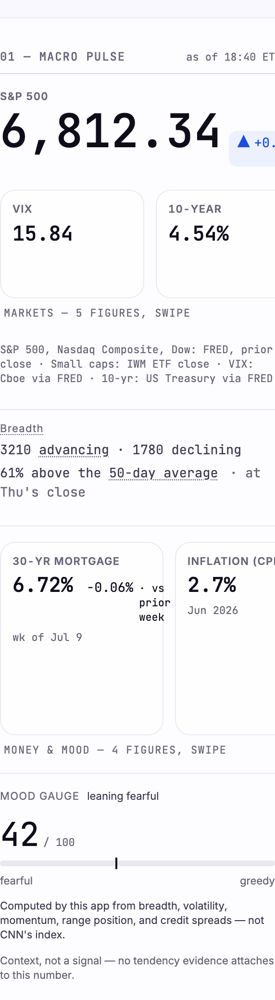
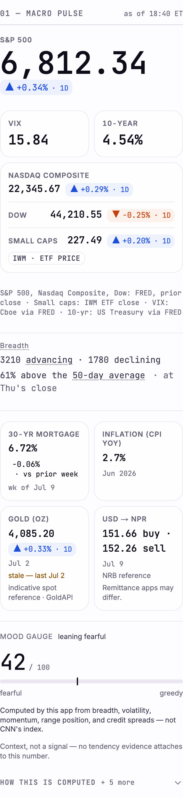

# PD4 — the phone composition

**Tag:** `pd-4` · **Date:** 2026-07-14 · **Plan:** POLISH-AND-DEPTH-PLAN.md Part 7

The commission for this phase was "make the phone read properly": kill the horizontal scroll, retire
the two swipe-shelves, and sweep every room at the narrowest width the product honors.

It found three live bugs before it wrote a line of code, and then it wrote a fourth one itself and
had to be caught by a screenshot. That last part is the most useful thing in this file, so it is not
buried at the bottom.

---

## 1. What was already broken, measured on `pd-3`

Every number below was taken from a production build of the **tagged, green, fully-guarded `pd-3`
tree**, against the seeded night. Nothing here is hypothetical and nothing here was caused by PD4.

### 1.1 The Desk scrolled sideways. In production. At 360px.

```
pd-3, seeded night, 8 rooms swept:

  412px   page-overflow: none
  360px   page-overflow: /  +16px      ← the Desk. Sixteen pixels of sideways scroll.
```

**No guard saw this, and the reason is worth writing down.** The sideways-scroll sweep in
`hardening.spec.ts` runs at each project's own viewport, and the phone project is a Pixel 7 — **412px**.
At 412 the bug does not happen. The sweep was not wrong; it was **pointed at the one phone width where
the defect is invisible**, and it had been passing happily for months.

A guard that only ever asks its question at the comfortable end of a range is not measuring the range.

### 1.2 The mortgage cell's window token was shattered



Look at the 30-YR MORTGAGE cell. Its delta window renders:

```
-0.06% · vs
     prior
      week
```

One word per line. **This shipped.** The window `<span>` had `white-space: normal` and nothing
forbade it from wrapping its own text, so in a narrow cell it did. It is the same failure mode as
PD3's Range Ladder — a phrase broken into vertical confetti — one component over, and nobody had
looked.

### 1.3 The two shelves hid four of nine figures

The same frame shows it: "MARKETS — 5 FIGURES, SWIPE" with **two** figures on screen, and "MONEY &
MOOD — 4 FIGURES, SWIPE" with **two** on screen. The count lines were honest — that is what ruling M8
demanded of them — but M8's real demand is that a surface not hide an unstated number of things, and
there are two ways to satisfy it. *Say what you hide*, or *hide nothing*. PD4 takes the second.

Also visible: the S&P hero's own delta chip, running off the right-hand edge of the module.

---

## 2. The bug PD4 wrote, and how it was caught

This is the section that matters.

Part 7.1 specified the tape echoes (Nasdaq, Dow, small caps) as a **3-up grid of cards**. I built
exactly that. Then I measured it:

```
PD4, first attempt — the 3-up tape:

  412px  [tape] Nasdaq Composite  content= 91px   CHIP ON 2 LINES
  412px  [tape] Dow               content= 91px   CHIP ON 2 LINES
  360px  [tape] Nasdaq Composite  content= 74px   SPILLS 8px "22,345.67"   CHIP ON 3 LINES
  360px  [tape] Dow               content= 74px   SPILLS 8px "44,210.55"   CHIP ON 3 LINES

  page horizontal overflow: 0px          ← every guard green
```

**Read those last two lines together.** The index levels were overflowing their cards by 8px — sitting
underneath the border of the card next door — and the delta chips had shattered into three lines
("▲" / "+0.29%" / "· 1D"), *and the page reported zero horizontal overflow*. The unit tests passed.
The class contract passed. The 360px sweep I had just written passed. The numbers were all correct.

Only the screenshot showed it.

### 2.1 Why the sweep is blind to this, and what now covers it

The sideways-scroll sweep asks the **document** a question:

```js
document.documentElement.scrollWidth === document.documentElement.clientWidth
```

A cell that overflows into the cell **next door** never touches the document's `scrollWidth`. The
spill lands *inside* the page, not past its edge. So the page is honestly clean while a figure sits
under the border of its neighbour.

PD3's law was "layout is asserted in bounding boxes, never the DOM." PD4 adds the sharper form:

> **A page-level overflow guard cannot see a cell-level overflow. The question has to be asked of the
> CELL.**

`e2e/desk.spec.ts` now asks it — for every macro cell, does anything inside this box reach past the
box's *content* edge (not its border edge: a figure sitting in the card's own padding is already
touching the wall). That test is the one that would have failed on the broken build.

### 2.2 The arithmetic that killed the 3-up

It is not a tuning problem. It does not close at any type scale:

| | 360px | 412px |
|---|---|---|
| 3-up cell interior | **74px** | **91px** |
| an index level, `22,345.67` | ~81px | ~81px |
| its delta chip, `▲ +0.29% · 1D` | ~95px | ~95px |

The plan's own estimate for this cell was "≈112px interior". The measured reality is 74px. A mono
numeral has **no wrap opportunity inside itself** — it cannot be made to fit, only to overflow.

**Amendment (logged in DECISIONS.md):** the tape becomes a **full-width list** — one row per index,
label left, figure and chip right. It keeps 7.1's argument completely intact. That argument was never
"three columns"; it was that the risk gauges (VIX, the 10-year) carry information the 64px hero does
**not** have and deserve room, while the tape echoes merely restate it and should read as supporting
data. **Cards above, a list below** says that more plainly than a big card beside a small one ever did
— and a list spends the phone's one abundant axis (its width) instead of fighting over its scarcest.

---

## 3. The healed frame



```
PD4, seeded night, 8 rooms swept:

  412px   page-overflow: none
  360px   page-overflow: none        ← was +16px

per-cell spill, all nine macro cells, 360px and 412px:   none
chips on more than one line:   the mortgage only, and it breaks CLEANLY —
                               "▼ -0.06%" / "· vs prior week", the window WHOLE.
```

Everything is on screen. Nothing is behind a swipe. Nothing overflows its cell. Nothing is shattered.

Module height, 360px → 412px: **1240px → 1206px.** Wider ⇒ shorter, which is the direction PD3's law
requires; a page that gets wider must not get taller.

---

## 4. The wrap contract (§7.2), in its final form

Three versions were built. Each wrong one was found by **looking**, never by a test.

| | what it did | what happened |
|---|---|---|
| **v1** | no wrap at all | the chip overflowed its card and sat under the card next door |
| **v2** | `flex-wrap` on the chip | it shattered: "▲" / "+0.29%" / "· 1D" — one token per line |
| **v3** | wrap **between atoms**, never within one | correct |

**The chip has exactly two atoms:** the *signed delta* (`▲ +0.29%` — glyph, sign and number are one
fact spelled three redundant ways) and its *window* (`· 1D`, `· vs prior week` — the delta's unit).
Each is `whitespace-nowrap`. The chip is `flex-wrap`, so when a cell cannot hold both, the window
drops to a second line **whole**.

The principle, which is now in LESSONS.md and PATTERNS.md:

> "Wrapping is honest, truncating is not" is a claim about a **sentence**. A phrase broken one word
> per line has not been wrapped — it has been **shattered**, and a shattered figure is no more
> readable than a truncated one. **The unit of wrapping is the atom: the smallest group that still
> means something on its own.**

---

## 5. The oracle was photographing a hover state

The phone login gained a mark (below). That pushed the **Sign-in button** down a few dozen pixels.
And that — on a page PD4 does not touch — moved the price label on `/ticker`'s candle chart from
**214.54 to 213.02**.

Which is an alarming sentence, so here is the chain:

1. `signIn()` **clicks** the Sign-in button. Chromium leaves the pointer resting exactly where that
   click landed, and Playwright never moves it again.
2. On `/ticker/AAPL`, the candle chart happens to sit **under that stationary cursor**.
3. lightweight-charts concludes it is being hovered and draws a **crosshair** — two dashed lines and
   a black price pill — straight into the screenshot.
4. So the committed ticker baseline encoded **where a button on a different page was**.

It reproduced **byte-for-byte on a re-run** (2328 differing pixels, twice), so it was never flake.
And the candles themselves were **pixel-identical** — the *only* thing that moved was a crosshair
that no reader ever sees on arrival.

`shoot()` now parks the mouse at `(0, 0)` before every screenshot. The ticker's baselines are
re-minted without the crosshair; the `214.00` axis label is legible again, because a phantom price
pill is no longer sitting on top of it.

> **This is PD3's law for the third time, and it is always the same law: a baseline proves the page
> did not CHANGE. It never proved the page was RIGHT.** This one was exact, green and reproducible
> for months. PD2's version: a *tolerated* baseline is still wrong. PD3's: an *exact* baseline can
> still be wrong. PD4's: **a baseline can be a photograph of the test harness rather than of the
> app.** Ask of any diff on a page you did not touch — *is this the app, or is this the camera?*

### 5.1 And a real race, found by the rehearsal, fixed before the tag

The `mbp16` leg then failed `grid.spec.ts` with `mainRight: 0, railLeft: 0` — every Desk module
measuring at `left: 0`.

That is not a collapsed grid. That is an **unstyled page**: `page.goto()` resolves on `load`, which
does not guarantee the CSSOM has been applied to the layout the test then forces, and unstyled block
elements all begin at x = 0. It reproduced **on its retry** and never once locally, because it is a
race and CI is the slower machine. `grid.spec.ts` has always been able to lose it; PD3 got lucky.

Every assertion in that file is a bounding box, so it now waits for the design tokens to exist
(`--color-paper` is `""` until `globals.css` is in effect) and for fonts to settle, before measuring
anything.

> **PD3: layout is asserted in bounding boxes. PD4's corollary: a bounding box is only evidence once
> the thing that decides it has arrived.**

The failure message now prints the two numbers it measured. "Expected > 0, received 0" was the entire
diagnosis, and it made me guess.

---

## 6. What else shipped

- **The phone login has a mark.** The brand panel is `hidden lg:flex`, and the 96px lockup went out
  with it — so the first page anyone ever opens, on the device most people open it on, showed this
  product's name in text and nothing of its face. A 48px lockup now sits above the headline below
  `lg`. It reuses the 192px asset and **costs no new request**: a `display:none` subtree still
  downloads its images, so the phone was already fetching it for the panel it cannot see.
  (This was the standing `[VETO?]` item PD3 left for PD4. Decided; still open to Bishan's veto.)
- **The copy deck shrank.** `copy.pulse.marketsShelf` and `copy.pulse.moneyShelf` are **deleted**, not
  orphaned — a count line announcing what is off the edge of the screen is a lie when nothing is.
  `copy.pulse.swipe` survives, because the `Shelf` primitive survives (it remains the house rail for
  filter-chip rows, and the styleguide renders a live specimen of it — a primitive with no demo is a
  primitive that rots).
- **The 360px sweep counts what it swept.** It walks every room in the manifest, tallies the visits,
  and refuses to pass if it visited none or fewer than the manifest lists. A sweep that measured
  nothing must not be allowed to report success.

---

## 7. The gate

Local: `typecheck` · `lint` · `test` (649) · `uv run pytest` (504 + 31 skipped) · `build` ·
`check:routes` · `check:bundles` (worst `/news` 196.3 KB, **unmoved** — composition is not JS) ·
`check:fonts` (243/560 KB) · `check:drift` (25) · `check:migrations` · `e2e:local`, one project at a
time (phone 216 · desktop 202 · wide 26 · mbp16 24).

Production: `check:live` all six green · `check:nav` · `check:lighthouse`.

**Two local failures were harness artifacts, not defects, and both are worth knowing about:**
- `thin-night`'s Law-2 test failed against a hand-started server because I had not set `CRON_SECRET`,
  so its ISR cache-bust silently no-opped and the test measured a **stale full-night render** (318px
  where it wanted ≤120). Let Playwright start its own server; its `webServer.env` sets it.
- `ticker-range` failed only under parallel local workers — the documented one-database race. Serial,
  it is green.

**VRT: 8 phone baselines re-minted** — the Desk ×2, the styleguide ×2, the login ×2 (it has a mark now) and the ticker ×2 (the crosshair
is gone). Every candidate was diffed against its committed baseline and **opened and looked at**.

**Two further shots came back byte-different and were NOT committed:** `news-filtered` (10px) and
`settings-light` (244px). They *passed* their comparison — this is the rasterisation jitter that
`--update-snapshots=all` always produces, and the PD2 law cuts both ways: what moved and what failed
are not the same list, in **either** direction.

The desktop, wide and mbp16 legs did not move a pixel: the grids are `md:hidden`, the chip's atom
regrouping is spacing-neutral, and their resting pointer was never over the chart.

---

**GATE SIZE AT `pd-4`: 25 drift rules · 83 VRT baselines · 24 e2e specs · 649 unit tests · 16 bundle
baselines · 14 manifest rooms · 4 oracle legs · tag run 8 m 48 s.**

**The gate did not grow.** No new drift rule, no new spec file, no new baseline, no new room. PD4 added
**7 unit tests** (StatFigure's own file) and **three browser assertions** inside specs that already
existed — the 360px sweep, the per-cell overflow guard, and the phone macro-grid composition — and it
**replaced 8 phone baselines** rather than adding any. The one structural change is that `grid.spec.ts`
now waits for the page to be styled before it measures it, which makes an existing suite honest rather
than larger.
